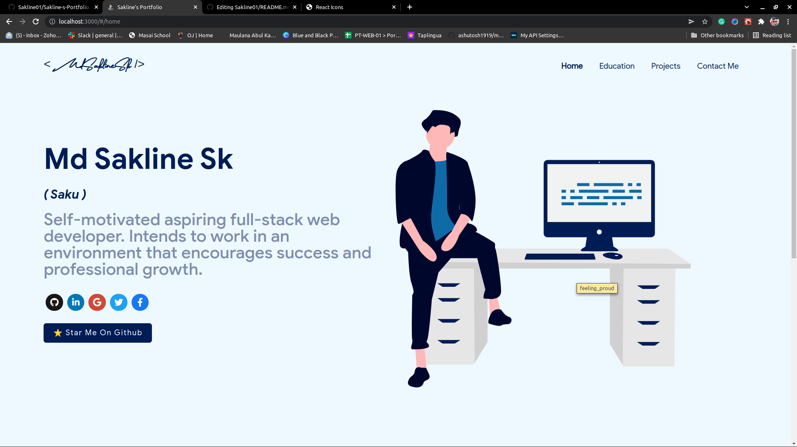
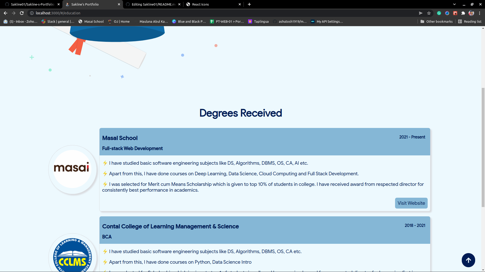
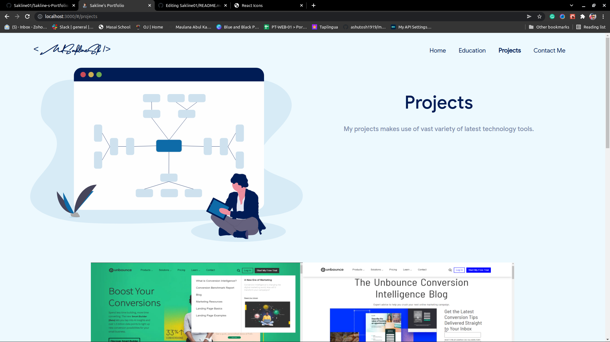
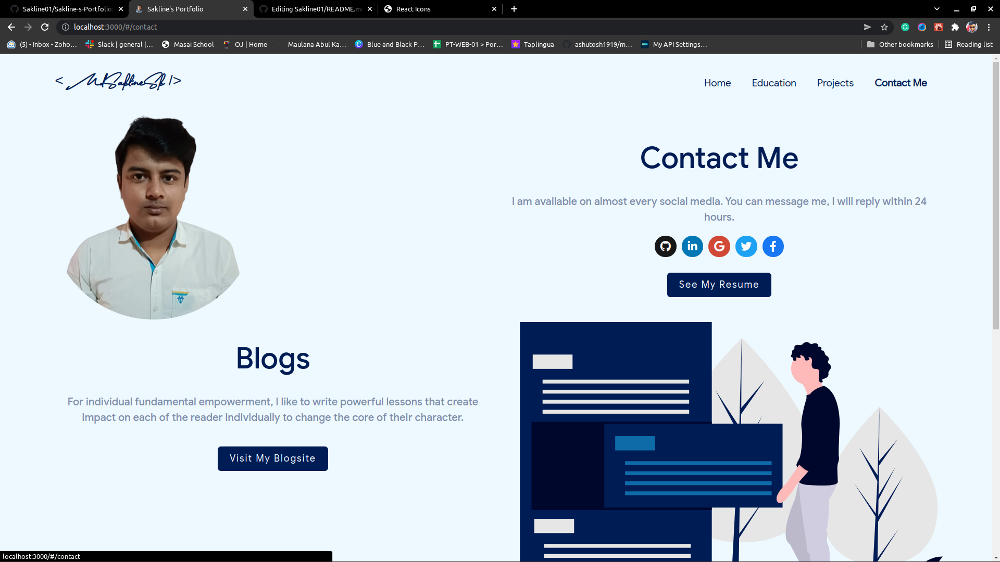

# Sakline-s-Portfolio

This is the repo of my portfolio. It is build with react.

<h2>If you want to clone clone it.</h2>
Steps:-
<h4>1.git clone ...</h4>
<h4>2.after cloning first run npm install</h4>
<h4>3.after that npm install react-icons --save</h4>
<h4>4.npm run start </h4>
# and your project is ready to go;

<h3>Tech Stack used:</h3>
<ul>
  <li>HTML</li>
  <li>CSS</li>
  <li>Javascript</li>
</ul>

<h2>Quick view of the project:</h2>
1. The Landing Page

2. The Education Page
 

3. The Project Page
 

4. The Contact Page
 

